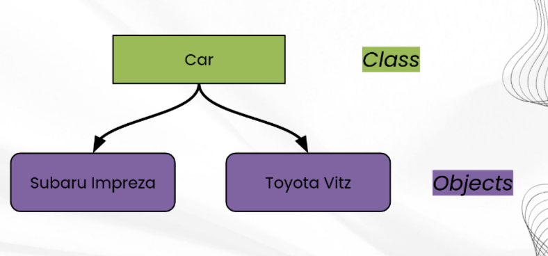

# The Four Pillars of OOP

## Pillars 1: Encapsulation Grouping Information

## What are objects

- Objects are Nouns: Book, Pen
- Methods are Verbs: is hardback
- Objects are Nouns: SaleList
- Methods are Verbs: add so SaleList, remove from SaleList, book X is on SaleList

# Objects

- An object represents an entity in the real world that can be distinctly identified
- An object has properties/states and behavirous
- eg student objects:
  - **properties:** name, age, student id, degree etc
  - **behavirous:** attending classes, doing assignments, taking exams

# Class

- A class is a template, blueprint, or a contract that describes and object's states and behavirous
- An object is an instance of the class:
  - Student class

## Creating a class

- How do we describe a car

- **properties:** name, brand, colour, engine, size...
- **behavirous:** drive, brake, stop, increase/decrease speed, reverse, drift...

# Objects

An object is an instance of that idea

- Many objects can be of the same class
- Objects have attributes:
  - Data
  - Methods

To create a new class we use the following:

- pulbic class <class name>
- To create an object, we call the ***constructor*** from the class
  - A constructor must have the same name as the class itself
  - constructors plays the role of initilising objects
  - constructors do not have a return type - not even void
